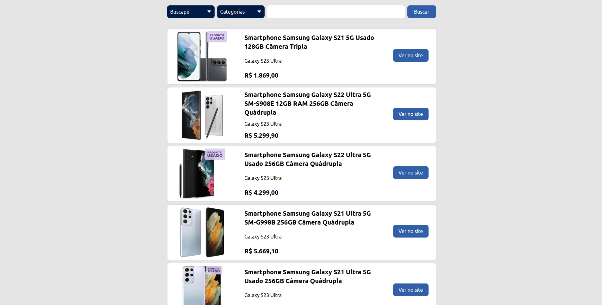
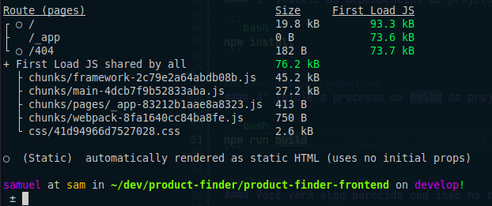
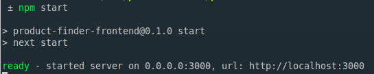
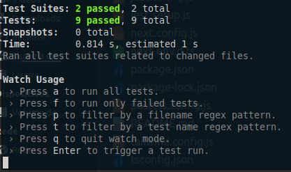

# Product Finder



> O Product Finder é uma aplicação web que utiliza a técnica de Web Scraping (Raspagem de dados) para buscar e exibir produtos dos sites Mercado Livre e Buscapé.

## [Acesse Product Finder na web](https://productfinder.vercel.app/)

## 🛠️ Tecnologias utilizadas

- [Next.js](https://nextjs.org/)
- [React](https://react.dev/)
- [TypeScript](https://www.typescriptlang.org/)
- [Tailwind CSS](https://tailwindcss.com/)
- [Axios](https://axios-http.com/)
- [ESLint](https://eslint.org/)
- [Prettier](https://prettier.io/)
- [Jest](https://jestjs.io/pt-BR/)
- [RTL](https://testing-library.com/)

## 🌱 Pré-requisitos

- Instale a última versão do [Node](https://nodejs.org/en/);
- Para garantir o funcionamento de todas as funcionalidades da aplicação é recomendado o uso do [Google Chrome](https://www.google.com/intl/pt-BR/chrome/);
- Para clonar o repositório instale e configure o [git](https://git-scm.com/).

## ▶️ Executando o projeto localmente

#### 1º Abra um terminal e faça o clone do projeto em sua máquina

```bash
git clone https://github.com/SP-Sam/product-finder-frontend.git

# Se você tem uma chave SSH configurada
git clone git@github.com:SP-Sam/product-finder-frontend.git
```

#### 2º Navegue até o diretório do projeto clonado

```bash
cd product-finder-frontend
```

#### 3º Instale as dependências do projeto

```bash
npm install
```

#### 4º Inicie o processo de build do projeto e aguarde até estar finalizado

```bash
npm run build
```

#### Você verá algo parecido com isso no terminal



#### 5º Inicie o projeto

```bash
npm start
```

#### Você verá algo parecido com isso no terminal



#### É só dar um `Ctrl+Click` no link ou colar `http://localhost:3000` no seu navegador e começar a usar!

## 🧪 Executando os testes do projeto

O Product Finder possui testes unitários. Para executa-los abra um terminal na raiz do projeto e rode o seguinte comando:

```bash
npm test
```

#### Você verá algo parecido com isso no terminal



#### os testes serão executados no `watch mode` do Jest. Para sair do `watch mode` basta apertar a tecla `q` ou `Ctrl+C`.

## 👨‍💻 Desenvolvedor

<a href="https://www.linkedin.com/in/spsam/">
  
  <br>
  <b>Samuel Pereira</b>
</a>

## 🖋️ Licença

Este projeto é um desafio técnico para um processo seletivo da empresa [Lextart](https://lexartlabs.com/), portanto não possui fins lucrativos e não está licenciado.

[⬆️ Voltar ao topo](#product-finder)
<br>
